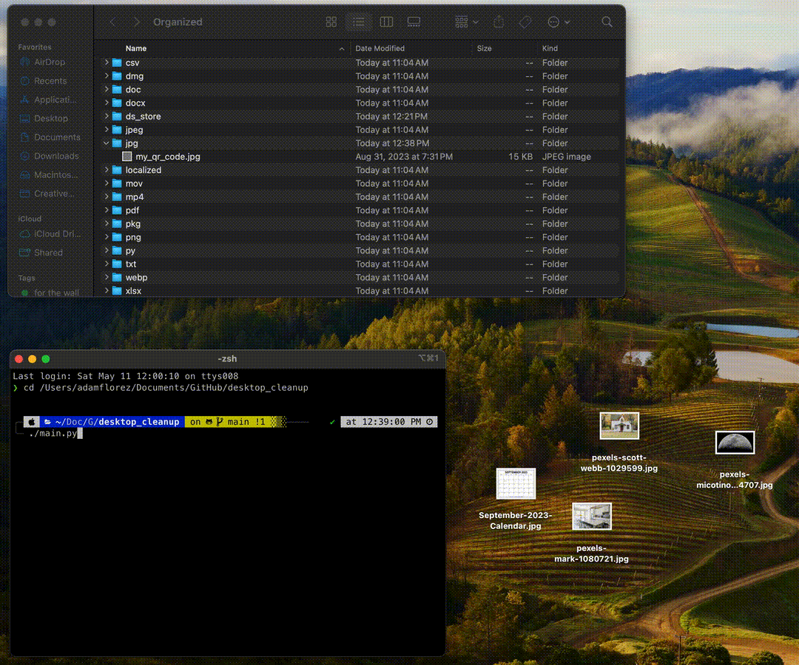

# Desktop Cleanup Script

This Python script automates the organization of files on your desktop into folders based on their file extensions, helping maintain a clean and organized desktop environment on MacOS.

## Features

- **Automatic Organization**: Automatically moves files into designated folders based on file type.
- **Customizable**: Script parameters can be adjusted to change target directories and file handling rules.



## Prerequisites

- **Python 3**: Ensure Python 3 is installed on your system. You can check this by running `python3 --version` in your terminal. If Python is not installed, visit [Python's official site](https://www.python.org/downloads/) to download and install it.

## Installation

1. Clone the repository or download the script:
    ```bash
    git clone https://github.com/yourusername/desktop_cleanup.git
    cd desktop_cleanup
    ```

2. Make sure the script is executable:
    ```bash
    chmod +x desktop_cleanup.py
    ```

3. Add the shebang line to the top of your script if it's not already there:
    ```python
    #!/usr/bin/env python3
    ```
    This line should be the very first line in the script.

## Usage

To run the script manually:
```bash
./desktop_cleanup.py
```

## Automating the Script with Cron (MacOS)
To have the script run automatically at a set time every day, you can use the cron scheduler available in MacOS. Here's how to set it up:

### Step 1: Open Terminal
Find the Terminal in Applications > Utilities and open it.

### Step 2: Edit Your Crontab
In the terminal, type:

```bash
crontab -e
```
If prompted to select an editor, choose nano for simplicity.

### Step 3: Schedule the Script
Add the following line to run the script every day at 7 AM:

```cron
0 7 * * * /usr/bin/env python3 /path/to/your/desktop_cleanup/main.py
```
Replace /path/to/your/desktop_cleanup/main.py with the actual path to your script.

### Step 4: Save and Exit
If using nano, press CTRL+X, then Y to save, and Enter to exit.
If using vi, press Esc, then type :wq and press Enter.

### Step 5: Verify the Cron Job
Check that your cron job has been added by typing:

```bash
crontab -l
```

### Step 6: Check Execution
After the script runs (based on the time you set), check the desktop or script directory for any logs or output to verify that it executed correctly.

## Troubleshooting

- Permissions: Make sure the script file has execute permissions.
- Python Path: Ensure that the shebang line correctly points to Python 3 (which python3 to find the path).
- Cron Environment: Remember, cron may have a different PATH environment, so always use full paths in scripts and cron jobs.
Contributing

Feel free to fork the repository, make improvements, and submit pull requests.